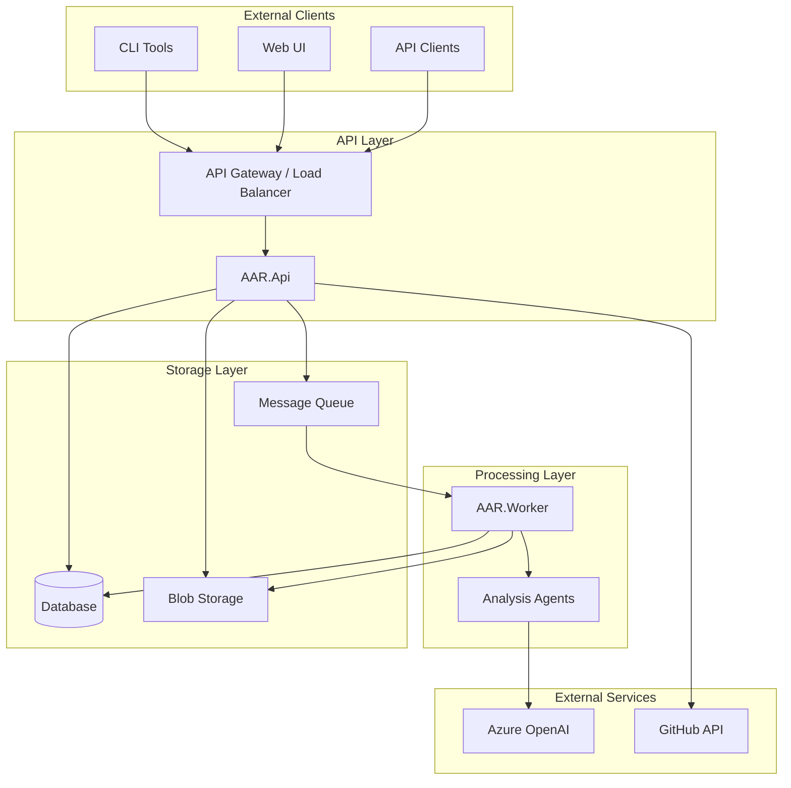
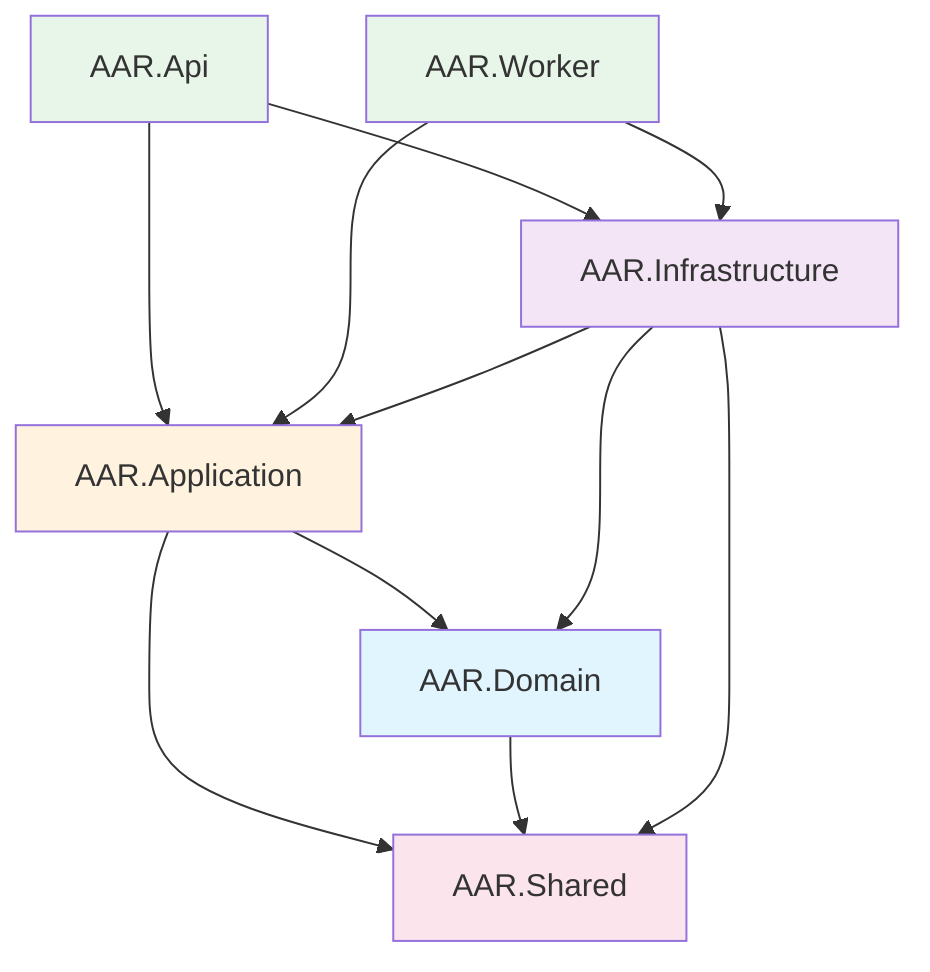
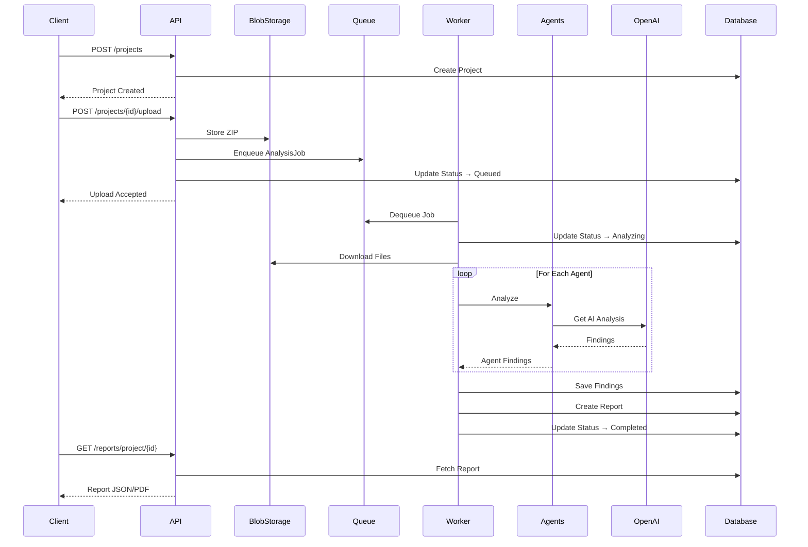
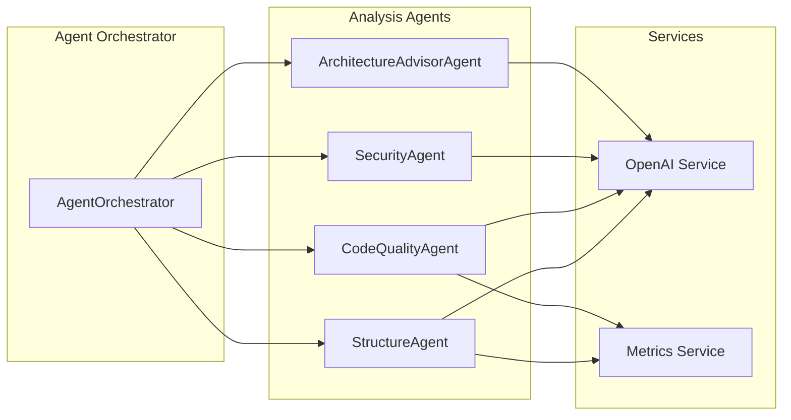
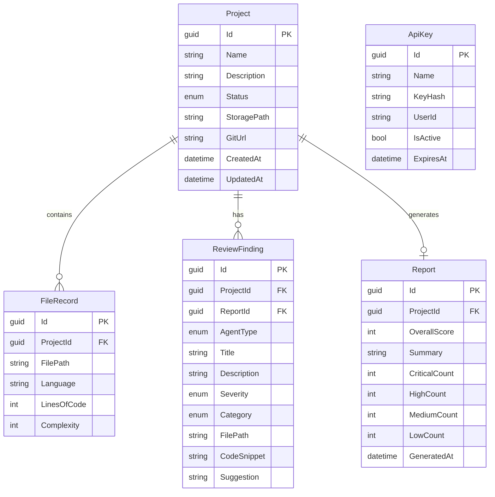
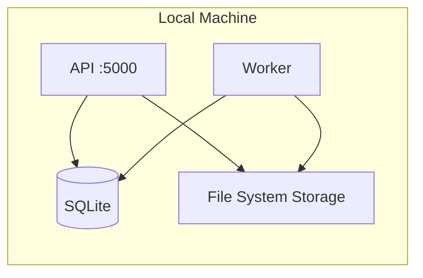
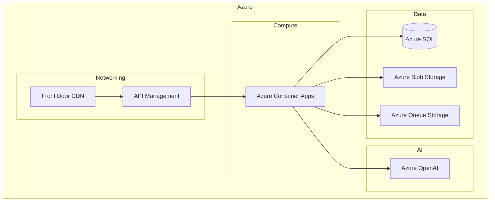
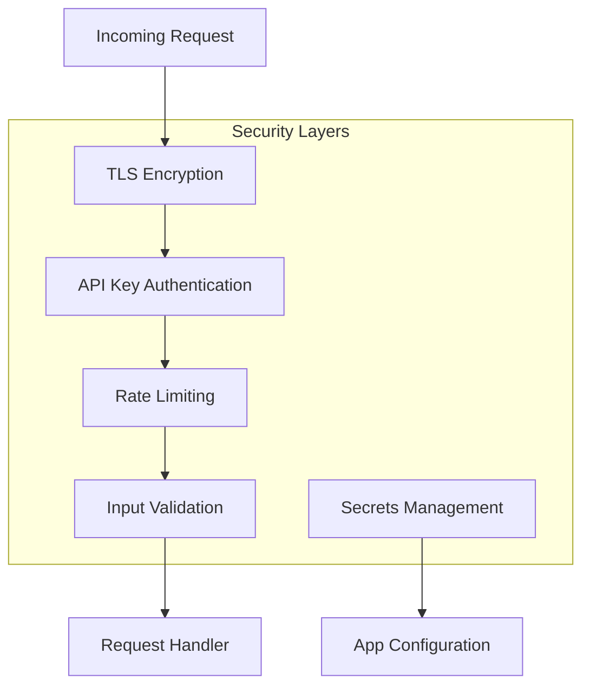
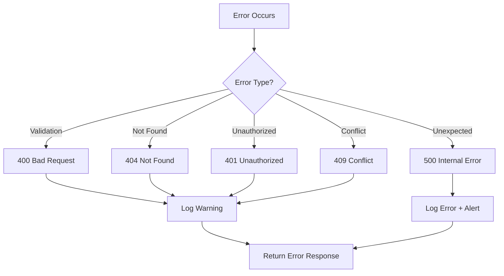

# AAR Architecture Documentation

## Overview

The Autonomous Architecture Reviewer (AAR) is designed following **Clean Architecture** principles, ensuring separation of concerns, testability, and maintainability.

## System Architecture

## Layer Dependencies

## Project Structure

### AAR.Shared
Common utilities shared across all projects:
- `Result<T>` - Result pattern for error handling without exceptions
- `Error` - Strongly-typed error representation
- `PagedResult<T>` - Pagination wrapper

### AAR.Domain
Core business entities and interfaces:
- **Entities**: `Project`, `Report`, `ReviewFinding`, `FileRecord`, `ApiKey`
- **Value Objects**: `LineRange`, `FileMetrics`
- **Enums**: `Severity`, `FindingCategory`, `ProjectStatus`, `AgentType`
- **Interfaces**: Repository contracts (`IProjectRepository`, etc.)

### AAR.Application
Business logic and orchestration:
- **Services**: `ProjectService`, `ReportService`, `ReportAggregator`
- **DTOs**: Data transfer objects for API communication
- **Interfaces**: External service contracts (`IBlobStorageService`, `IOpenAiService`, etc.)
- **Validators**: FluentValidation validators

### AAR.Infrastructure
External implementations:
- **Persistence**: EF Core `DbContext`, Repository implementations
- **Storage**: `FileSystemBlobStorage`, `AzureBlobStorage`
- **Queue**: `InMemoryQueueService`, `AzureQueueService`
- **AI**: `AzureOpenAiService` with mock mode
- **Git**: `GitService` for cloning repositories

### AAR.Api
REST API:
- **Controllers**: `ProjectsController`, `ReportsController`
- **Middleware**: `ExceptionHandlingMiddleware`, `ApiKeyAuthMiddleware`
- Health checks, OpenAPI/Swagger

### AAR.Worker
Background processing:
- **AnalysisWorker**: Hosted service polling the queue
- **Agents**: `StructureAgent`, `CodeQualityAgent`, `SecurityAgent`, `ArchitectureAdvisorAgent`
- **AgentOrchestrator**: Coordinates agent execution

## Data Flow

## Agent Architecture

### Agent Responsibilities

| Agent | Focus Areas | Severity Range |
|-------|-------------|----------------|
| **StructureAgent** | Folder organization, naming, project layout | Info → Medium |
| **CodeQualityAgent** | Complexity, code smells, best practices | Low → High |
| **SecurityAgent** | OWASP Top 10, secrets, vulnerabilities | Medium → Critical |
| **ArchitectureAdvisorAgent** | Patterns, scalability, design | Info → High |

## Database Schema

## Deployment Architecture

### Development

### Production (Azure)

## Security Architecture

### Security Controls

1. **Authentication**: API Key validation via `X-API-Key` header
2. **Authorization**: Key-based access control
3. **Input Validation**: FluentValidation on all inputs
4. **Secrets**: Environment variables / Azure Key Vault
5. **Transport**: TLS 1.2+ required
6. **Logging**: Structured logging with PII redaction

## Scalability Considerations

### Horizontal Scaling
- **API**: Stateless, scales horizontally behind load balancer
- **Worker**: Multiple instances can process queue concurrently
- **Database**: Connection pooling, read replicas for queries

### Performance Optimizations
- Async/await throughout for non-blocking I/O
- Pagination for large result sets
- File streaming for uploads/downloads
- Caching headers for static responses

### Bottleneck Mitigation
| Component | Strategy |
|-----------|----------|
| Database | Connection pooling, indexing, query optimization |
| OpenAI API | Rate limiting, retry with exponential backoff |
| Blob Storage | CDN for downloads, chunked uploads |
| Queue | Visibility timeout, dead-letter queue |

## Error Handling Strategy

## Monitoring & Observability

### Logging
- **Serilog** with structured logging
- Correlation IDs across requests
- Log levels: Debug, Info, Warning, Error

### Health Checks
- `/health` - Overall system health
- `/health/ready` - Readiness probe
- `/health/live` - Liveness probe

### Metrics (Future)
- Request duration histogram
- Queue depth gauge
- Agent execution time
- Error rate counters

## Future Enhancements

1. **Real-time Updates**: SignalR for live analysis progress
2. **Multi-tenant**: Organization-based isolation
3. **Custom Rules**: User-defined analysis rules
4. **Integration**: GitHub Actions, Azure DevOps integration
5. **Caching**: Redis for report caching
6. **ML Enhancement**: Fine-tuned models for domain-specific analysis
